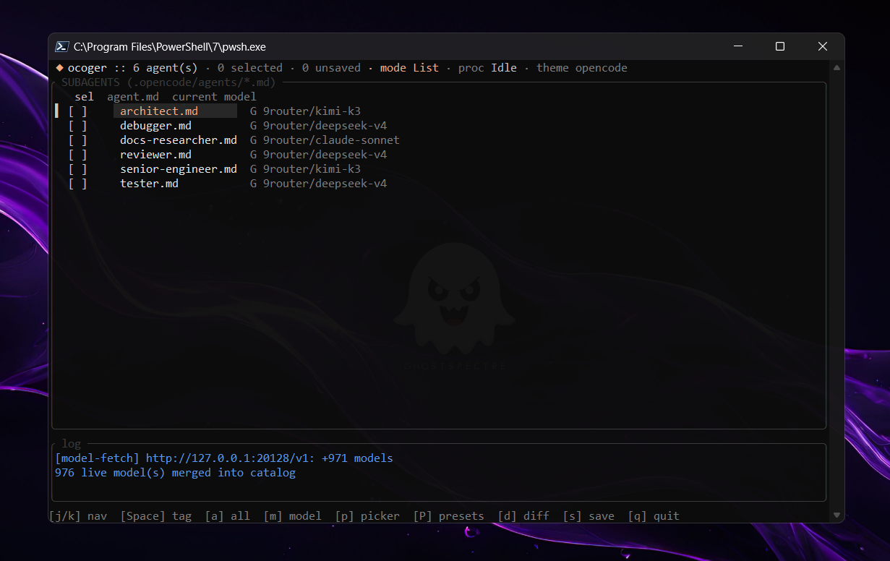
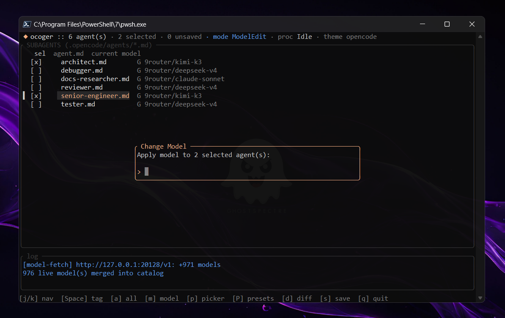

# Ocoger (OpenCode Manager)

> A fast native Rust TUI for managing OpenCode subagent configurations, global JSONC settings, dynamic model discovery, and supervised process restarts.

---

## Key Features

* **Zero-friction configuration** — edit single or multiple subagent configs (`.opencode/agents/*.md`) simultaneously without leaving the terminal.
* **Dynamic model discovery** — queries `/v1/models` across configured OpenAI-compatible providers, live-merged into the picker with a loading indicator and `R` to re-fetch.
* **JSONC comment preservation** — edits `opencode.json` / `opencode.jsonc` via a CST engine, keeping comments, trailing commas, and indentation byte-for-byte.
* **Hot-restart automation** — restarts the supervised `opencode` process only after disk writes land.
* **Presets** — capture selected agents' settings, apply to selection or to all, delete, live-filter.
* **Parameter fine-tuning** — `model`, `temperature`, `top_k`, `top_p`, `reasoning_effort` via picker/modal/form bands.
* **Cross-platform** — prebuilt binaries for Windows (x64/arm64), Linux glibc + musl (x64/arm64 incl. Alpine and Termux), macOS (x64/arm64). Mouse support in modern terminals.

---

## Screenshots

| Subagents pane (list + batch-save) | Model edit modal |
|---|---|
|  |  |

---

## Installation

### One-line installers (prebuilt binaries)

Linux / macOS / Termux / WSL:

```sh
curl -fsSL https://raw.githubusercontent.com/eikarna/Ocoger/main/install.sh | sh
```

Windows (PowerShell):

```powershell
irm https://raw.githubusercontent.com/eikarna/Ocoger/main/install.ps1 | iex
```

Both resolve the latest GitHub release, pick the right asset for your OS/arch, and drop `ocoger` onto a user-local bin dir (`~/.local/bin` or `%LOCALAPPDATA%\Programs\ocoger`, added to `PATH` on Windows). Pin a version via `OCOGER_VERSION=v0.1.3` (POSIX env) or `$env:OCOGER_VERSION = 'v0.1.3'` before piping (PowerShell).

Or grab an archive manually from the [Releases](https://github.com/eikarna/Ocoger/releases) page.

### Building from source

Prerequisites: Rust toolchain (MSRV 1.75+) and an active OpenCode installation (or any OpenAI-compatible provider configured via `provider` in JSONC).

```bash
git clone https://github.com/eikarna/Ocoger.git
cd Ocoger
cargo build --release
cargo test
cargo install --path .
```

### Verify

```bash
ocoger   # opens the TUI in ./.opencode/agents
```

---

## Keybindings

### List mode

| Key | Action |
|---|---|
| `j`/`k`, `↓`/`↑`, wheel | Navigate |
| `Space` / `Enter` | Toggle selection on the active agent |
| Click | Move cursor (click again to toggle) |
| `a` | Toggle select-all / deselect-all |
| `m` | Batch model-edit modal |
| `p` | Model picker |
| `P` (Shift+P) | Preset picker |
| `d` | Diff preview of staged changes |
| `x` | Discard all staged changes (re-read from disk) |
| `R` (Shift+R) | Re-fetch provider model catalogs |
| `s` | Save dirty agents; restart supervised process |
| `r` | Force-restart supervised process |
| `q` / `Esc` | Quit (blocked while edits are unsaved) |

### Picker & Preset modals (focus-locked)

| Key | Action |
|---|---|
| `Tab` | Toggle focus: **Input** (every printable char filters) ↔ **List** (bindings active) |
| `↓`/`↑`, wheel | Move cursor (works in both focuses) |
| `Enter` | Accept highlighted item |
| `Esc` | Cancel |
| `j`/`k` (List focus) | Move cursor |
| `n` / `d` / `A` (List focus, Preset modal) | New from selection / delete / apply-to-all |

### Diff view

| Key | Action |
|---|---|
| `j`/`k`, `↓`/`↑`, wheel | Scroll (multi-file diffs are concatenated) |
| `Enter` / `Esc` | Close |

---

## Configuration

User keybindings: `~/.config/ocoger/keymaps.toml` (XDG-aware), project overrides in `<project>/.ocoger/tui_keymaps.toml`. Custom themes: `<project>/.ocoger/themes/*.toml`; select via the `theme` key in config.

### Agent file (`.opencode/agents/<agent>.md`)

```yaml
---
model: deepseek-r1
temperature: 0.7
top_p: 0.9
reasoning_effort: high
---
You are an expert Rust backend engineer...
```

### Global config (`opencode.jsonc`)

```jsonc
{
  // primary provider + auth reference (resolved through env at runtime)
  "model": "anthropic/claude-3-5-sonnet",
  "provider": "anthropic",
  "providers": [
    { "label": "openrouter", "options": { "base_url": "https://openrouter.ai/api/v1", "api_key": "${OPENROUTER_API_KEY}" } }
  ]
}
```

---

## License

Distributed under the MIT License. See `LICENSE` for details.
